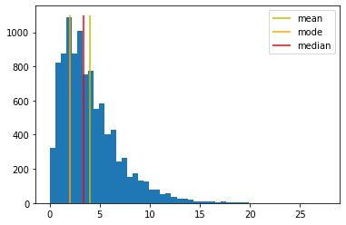
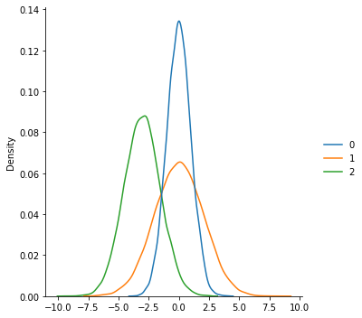

# 탐색적 데이터 분석 (Exploratory data analysis (EDA))

# 분포 분석 (수치형 변수)
## 위치 통계량
대표값과 그 위치
- 평균
- 중앙값
- 최빈값


```python
import numpy as np
import matplotlib.pyplot as plt
from statistics import *
from scipy import stats
np.random.seed(1)
N = 10000
df = 4
chi_data = np.random.chisquare(df = df, size = N).round(1)
_ = plt.hist(chi_data, bins=50)
mean_ = mean(chi_data)
mode_ = mode(chi_data)
med_ = median(chi_data)
plt.vlines(mean_, ymin=0, ymax=1100, color='y', label='mean')
plt.vlines(mode_, ymin=0, ymax=1100, color='orange', label='mode')
plt.vlines(med_, ymin=0, ymax=1100, color='r', label='median')
plt.legend()
```


    <matplotlib.legend.Legend at 0x7fe4f38549a0>


    

    


## 변이 통계량
데이터가 대표값으로부터 흩어져 있는 정도
- 범위
- 분산
- 표준편차


```python
N = 10000
np.random.seed(1)
a1 = np.random.normal(loc=0, scale=1, size=N)
a2 = np.random.normal(loc=0, scale=2, size=N)
a3 = np.random.normal(loc=-3, scale=1.5, size=N)
```


```python
import seaborn as sns
sns.displot([a1, a2, a3],kind='kde')
```


    <seaborn.axisgrid.FacetGrid at 0x7fe4e8f79eb0>


    

    


## 모양 통계량
데이터의 분포 모양, 대칭성을 설명
- 왜도
- 첨도
